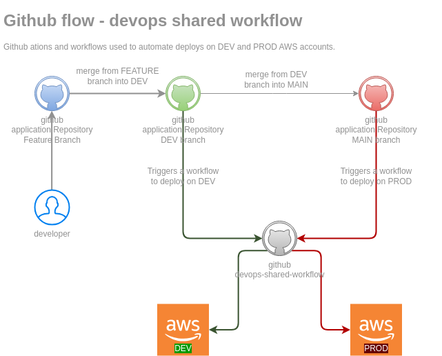
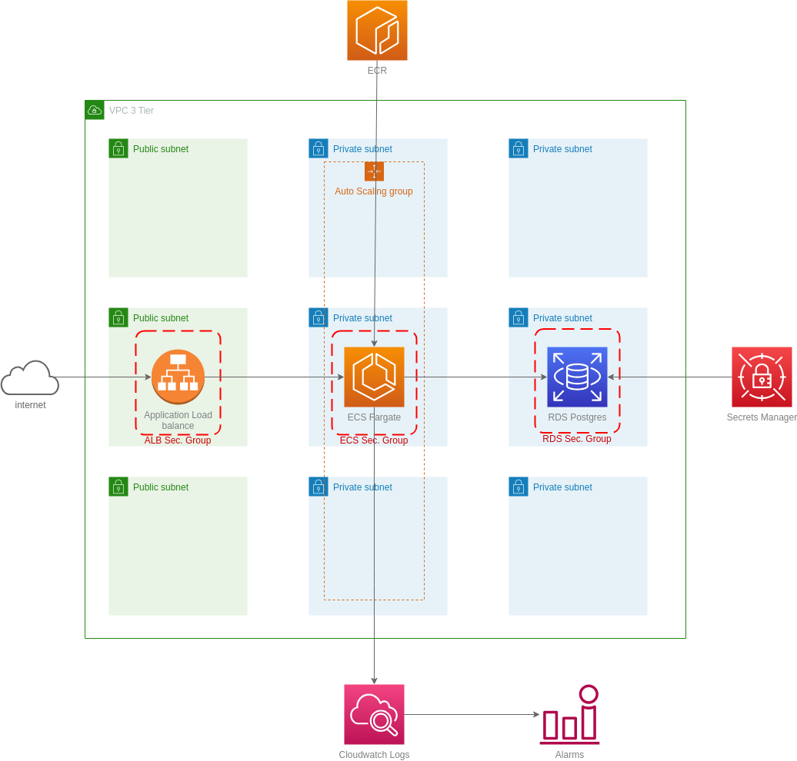

# Crunch Challenge

[Task Description](./task_description.md)

# Setup
## Github Repository Configuration
1. Add the following secrets on github.
[Official Documentation](https://docs.github.com/en/actions/security-guides/using-secrets-in-github-actions)

    | Parameter| Environment | Required |
    |---|---| --- |
    | AWS_ACCESS_KEY_ID_DEV  | DEVELOP | YES |
    | AWS_ACCESS_KEY_ID_PLATFORM_DEV | DEVELOP |  YES |
    | AWS_ACCESS_KEY_ID_PROD | PRODUCTION | YES |
    | AWS_ACCESS_KEY_ID_PLATFORM_PROD | PRODUCTION | YES |

2. Create the SSM Parameters that will be used by Database

Replace these values with your actual username and password

> **Note:** you must create the ssm entry manualy.
> For practical purposes only I'm using the same values recomended by the boilerplate repository
```
export DB_PASSWORD="white"
export JWT_SECRET="dfdhhf8gh523reh6qedn37dferpoawdn381j"

aws ssm put-parameter --name "/$ENVIRONMENT/crunch/db/password" --value "$DB_PASSWORD" --type "SecureString" --overwrite
aws ssm put-parameter --name "/$ENVIRONMENT/crunch/app/jwt_secret" --value "$JWT_SECRET" --type "SecureString" --overwrite

```

2. Fill the files `tfvars/dev.tfvars` and `tfvars/prod.tfvars` according to the values for each environment.

3. After the push to the branch, the pipeline will deploy the resources.

## GitFlow

> **Note:**  Only `develop` and `main` branches deploy to AWS.


# Solution

## Architecture diagram




## Explanation
### Architecture
### CI/CD Steps
### Monitoring and Alarms


# Official AWS Modules Used
- [VPC](https://github.com/terraform-aws-modules/terraform-aws-vpc)
- [RDS](https://github.com/terraform-aws-modules/terraform-aws-rds)

# FAQ
[Frequent Asked Questions](faq.md)